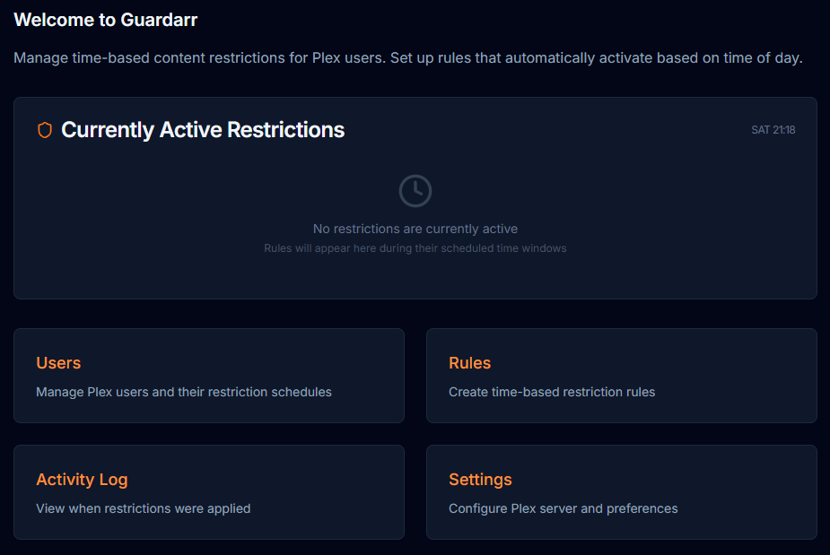
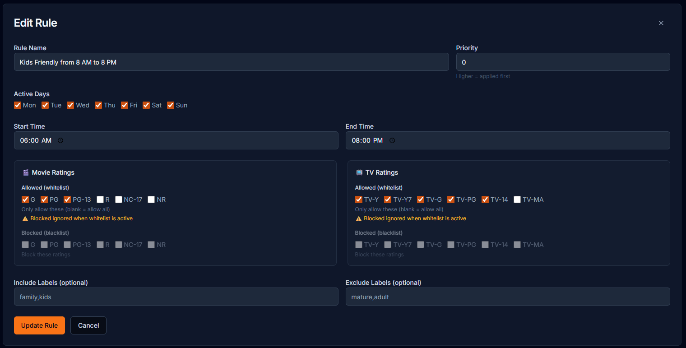

<p align="center"></p>

# Guardarr -- Plex doesn't understand bedtime

Time-based content restrictions for Plex Media Server.

## Features

- **Per-user restriction scheduling** — Set rules that activate automatically
- **Multiple rules per user** — Weekdays, weekends, custom schedules
- **Rating filters** — Allow/exclude specific content ratings by time
- **Label filters** — Plex labels as restriction criteria
- **Activity logging** — Track when restrictions change
- **Plex OAuth** — Login with your Plex account
- **Dark UI** — shadcn/ui with customizable accent colors


## Screenshots

| Login | Rules |
|-------|-------|
|  |  |

## Tech Stack

- Next.js 15 + TypeScript
- shadcn/ui + Tailwind CSS
- SQLite (local)
- Plex API (plex-api npm package)
- Docker + Docker Compose

## Quick Start

```bash
# Clone and setup
cd guardarr

cp .env.example .env.local
# Edit: PLEX_SERVER_URL, PLEX_ADMIN_TOKEN

docker-compose up -d --build
```

Access at: http://localhost:4600

## Configuration

Required environment variables:
- `PLEX_SERVER_URL` — Your Plex server URL (e.g., http://192.168.x.x:32400)
- `PLEX_ADMIN_TOKEN` — Your Plex admin token
- `NEXTAUTH_SECRET` — Random string for auth encryption
- `NEXTAUTH_URL` — Your domain (https://guardarr.yourdomain.com)

## Getting Plex Admin Token

1. Sign in to Plex Web app
2. Open browser DevTools → Network
3. Look for any request to `plex.tv` 
4. Find `X-Plex-Token` header value

See: https://support.plex.tv/articles/204059436-finding-an-authentication-token-x-plex-token/

## Schedule Enforcement

Runs every minute via cron inside container. Checks active rules and applies restrictions to configured users.

## License

MIT
