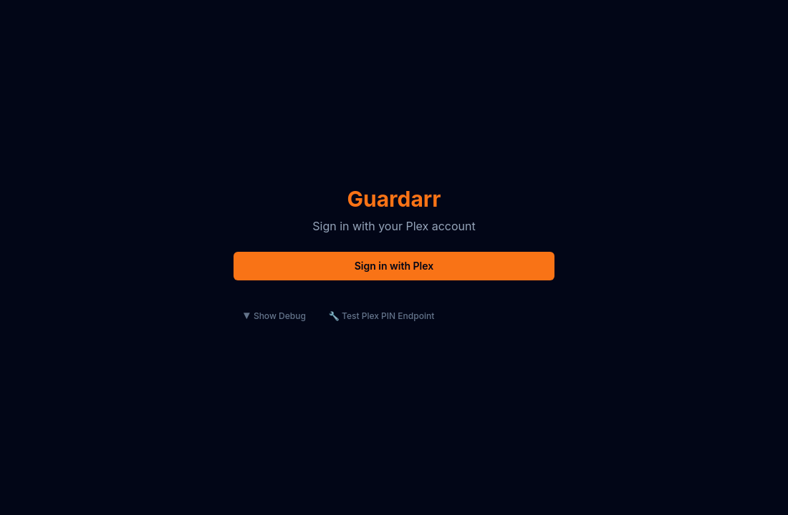
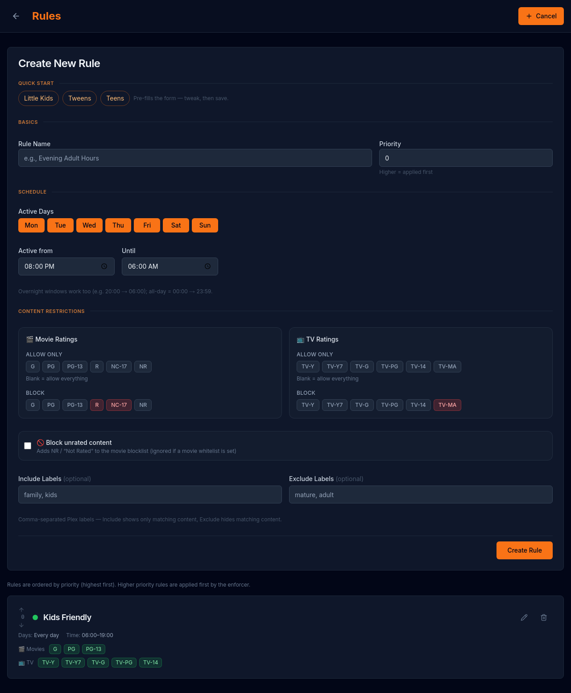

<p align="center"></p>

# Guardarr -- Plex doesn't understand bedtime

Time-based parental controls for Plex Media Server. Guardarr enforces per-user
content-rating and label filters on a schedule, so the right restrictions apply
automatically at the right times — and lift when they should.

## Features

### Scheduling & rules
- **Per-user restriction scheduling** — rules activate automatically by time window (overnight windows like `20:00 → 06:00` supported)
- **Multiple rules per user** — weekdays, weekends, custom day/time combinations, ordered by priority
- **Rule presets** — one-click *Little Kids / Tweens / Teens* starting points you can tweak
- **Bulk apply** — assign or remove a rule across all managed users at once
- **Auto-default rule** — automatically apply a chosen rule to new Plex users as they're discovered

### Content filtering
- **Rating filters** — allow or block specific movie & TV ratings per rule
- **Block unrated content** — toggle to also exclude NR / "Not Rated" titles
- **Label filters** — use Plex labels as include/exclude restriction criteria

### Access & control
- **Parent PIN** — require a PIN to grant temporary bypasses
- **Per-library access viewer** — read-only view of which Plex libraries each shared user can access
- **Plex OAuth** — sign in with your Plex account

### Reliability & operations
- **Enforcer health** — dashboard banner shows last run / last success / consecutive failures / token validity
- **Token validation** — proactively checks the Plex admin token and surfaces failures instead of silently doing nothing
- **Daily database backups** — online SQLite backup + WAL checkpoint, last 7 retained
- **Activity insights** — 7-day rollup of restriction changes, with an optional **weekly digest** to a webhook
- **Failure alerts** — optional webhook notification on repeated enforcement failures
- **Authenticated API** — middleware gates all API routes and protected pages behind NextAuth

### UI
- **Chip-based dark UI** — shadcn/ui + Tailwind, mobile-responsive, customizable accent colors

## Screenshots

| Login | Rules |
|-------|-------|
|  |  |

## Tech Stack

- Next.js 14 + React 18 + TypeScript
- shadcn/ui + Tailwind CSS
- better-sqlite3 (local SQLite, WAL mode)
- NextAuth (Plex OAuth, JWT sessions)
- Standalone enforcer process + Next.js server
- Docker

## Quick Start

```bash
cd guardarr

cp .env.example .env.local
# Edit: PLEX_SERVER_URL, PLEX_ADMIN_TOKEN, NEXTAUTH_SECRET, NEXTAUTH_URL

docker-compose up -d --build
```

Access at: http://localhost:4600

## Configuration

Required environment variables:
- `PLEX_SERVER_URL` — your Plex server URL (e.g., `http://192.168.x.x:32400`)
- `PLEX_ADMIN_TOKEN` — your Plex admin token (fallback; the token is normally stored in the DB and refreshed on each Plex sign-in)
- `NEXTAUTH_SECRET` — random string for auth/session encryption
- `NEXTAUTH_URL` — your domain (e.g., `https://guardarr.yourdomain.com`)

Optional:
- `ALERT_WEBHOOK_URL` — webhook for enforcement-failure alerts and the weekly digest (also configurable in Settings)

In-app settings:
- **Plex admin token** — re-paste after a rotation; every Plex sign-in persists the current token to the DB
- **Parent PIN** — set/clear the bypass PIN (stored hashed)
- **Default rule** — choose the rule auto-applied to new users
- **Notifications webhook** — powers failure alerts and the weekly digest

## Getting Plex Admin Token

Normally you don't need to find this manually — signing in with Plex stores the
token automatically. If you need it directly:

1. Sign in to the Plex Web app
2. Open browser DevTools → Network
3. Look for any request to `plex.tv`
4. Find the `X-Plex-Token` header value

See: https://support.plex.tv/articles/204059436-finding-an-authentication-token-x-plex-token/

## Schedule Enforcement

A standalone enforcer process runs every minute. Each cycle it evaluates active
rules and applies the corresponding content-rating + label restrictions to the
configured Plex users via the plex.tv API. It self-schedules with capped
exponential backoff on failure, validates the admin token periodically, records
its health to the database, and only re-applies a rule when its state changes.

## License

MIT
