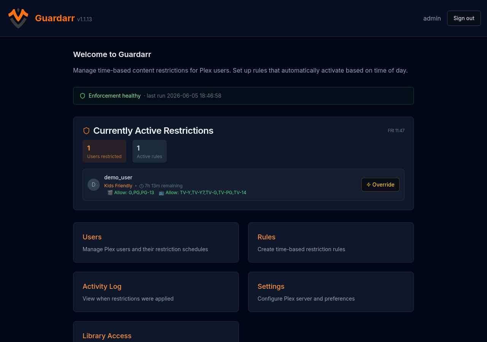

<p align="center"></p>

# Guardarr -- Plex doesn't understand bedtime

Time-based parental controls for Plex Media Server. Guardarr enforces per-user
content-rating and label filters on a schedule, so the right restrictions apply
automatically at the right times — and lift when they should.

## Features

### Scheduling & rules
- **Per-user restriction scheduling** — rules activate automatically by time window (overnight windows like `20:00 → 06:00` supported)
- **Multiple rules per user** — weekdays, weekends, custom day/time combinations, ordered by priority
- **Rule presets** — one-click *Little Kids / Tweens / Teens* starting points you can tweak
- **Bulk apply** — assign or remove a rule across all managed users at once
- **Auto-default rule** — automatically apply a chosen rule to new Plex users as they're discovered
- **Timezone-correct schedules** — windows are evaluated in *your* configured timezone, not the server's or container's clock

### Content filtering
- **Rating filters** — allow or block specific movie & TV ratings per rule
- **Block unrated content** — toggle to also exclude NR / "Not Rated" titles
- **Label filters** — use Plex labels as include/exclude restriction criteria

### Access & control
- **Parent PIN** — require a PIN to grant temporary bypasses
- **Per-library access viewer** — read-only view of which Plex libraries each shared user can access
- **Plex OAuth** — sign in with your Plex account

### Reliability & operations
- **Self-healing enforcement** — every cycle reconciles against the live filters on plex.tv, so restarts, restored backups and out-of-band edits correct themselves
- **Durable applied-state** — what's currently applied is recorded in the database, not process memory, so a restart can never strand a user in a restriction
- **Bypass-aware** — an active temporary bypass suppresses re-application and survives restarts; protection returns automatically the moment it expires
- **Enforcer health** — dashboard banner shows last run / last success / consecutive failures / token validity
- **Token validation** — proactively checks the Plex admin token and surfaces failures instead of silently doing nothing
- **Daily database backups** — online SQLite backup + WAL checkpoint, last 7 retained
- **Activity insights** — 7-day rollup of restriction changes, with an optional **weekly digest** to a webhook
- **Failure alerts** — optional webhook notification on repeated enforcement failures
- **Authenticated API** — middleware gates all API routes and protected pages behind NextAuth

### UI
- **Chip-based dark UI** — shadcn/ui + Tailwind, mobile-responsive, customizable accent colors

## Screenshots

| Dashboard | Rules |
|-----------|-------|
|  |  |

## Tech Stack

- Next.js 14 + React 18 + TypeScript
- shadcn/ui + Tailwind CSS
- better-sqlite3 (local SQLite, WAL mode)
- NextAuth (Plex OAuth, JWT sessions)
- Standalone enforcer process + Next.js server
- Docker

## Quick Start

```bash
cd guardarr

cp .env.example .env.local
# Edit: PLEX_SERVER_URL, PLEX_ADMIN_TOKEN, NEXTAUTH_SECRET, NEXTAUTH_URL

docker-compose up -d --build
```

Access at: http://localhost:4600

## Configuration

Required environment variables:
- `PLEX_SERVER_URL` — your Plex server URL (e.g., `http://192.168.x.x:32400`)
- `PLEX_ADMIN_TOKEN` — your Plex admin token (fallback; the token is normally stored in the DB and refreshed on each Plex sign-in)
- `NEXTAUTH_SECRET` — random string for auth/session encryption
- `NEXTAUTH_URL` — your domain (e.g., `https://guardarr.yourdomain.com`)

Optional:
- `TIMEZONE` — IANA timezone used to evaluate rule schedules, e.g. `America/Los_Angeles` (fallback; normally set in Settings and stored in the DB). Defaults to `America/Los_Angeles`.
- `ALERT_WEBHOOK_URL` — webhook for enforcement-failure alerts and the weekly digest (also configurable in Settings)

In-app settings:
- **Timezone** — the timezone rule windows are interpreted in; set this to your household's timezone
- **Plex admin token** — re-paste after a rotation; every Plex sign-in persists the current token to the DB
- **Parent PIN** — set/clear the bypass PIN (stored hashed)
- **Default rule** — choose the rule auto-applied to new users
- **Notifications webhook** — powers failure alerts and the weekly digest

## Getting Plex Admin Token

Normally you don't need to find this manually — signing in with Plex stores the
token automatically. If you need it directly:

1. Sign in to the Plex Web app
2. Open browser DevTools → Network
3. Look for any request to `plex.tv`
4. Find the `X-Plex-Token` header value

See: https://support.plex.tv/articles/204059436-finding-an-authentication-token-x-plex-token/

## Schedule Enforcement

A standalone enforcer process runs every minute alongside the web app. Each cycle it:

1. Reads the current day/time **in the configured timezone** (`settings.timezone`,
   falling back to the `TIMEZONE` env var, default `America/Los_Angeles`) using `Intl`
   — never the container's clock, so a container running in UTC still enforces a
   `14:00–19:00` rule at 2pm–7pm local.
2. Picks the winning rule per user. Plex stores a single filter per user, so when
   several rules match, the highest `priority` wins (ties broken by rule id).
3. Fetches every managed user's **live filters from plex.tv** and compares them with
   what the winning rule wants.
4. Writes only on real divergence — a `PUT` happens when a rule starts, ends, or is
   edited, or when the live state has drifted from what Guardarr applied. Steady state
   makes no writes at all.

### Durability

What is currently applied is recorded in the `applied_restrictions` table, not in
process memory, and each cycle is reconciled against plex.tv. This means a restart,
a crash or a restored backup cannot strand a user inside a restriction that never
lifts — the next cycle notices the mismatch and corrects it. Filters that Guardarr
did not set, and that match none of the user's rules, are deliberately left alone
rather than clobbered.

### Bypasses

An unexpired temporary bypass outranks every rule: restrictions are cleared and
re-application is suppressed for as long as it lasts, across restarts. When it
expires, protection is restored automatically on the next cycle.

### Failure handling

The loop self-schedules with capped exponential backoff (60s → 5 min) on failure,
validates the Plex admin token periodically, records its health to the database, and
can alert a webhook after repeated failures. If plex.tv is unreachable, it falls back
to the state recorded in the database rather than guessing.

## License

MIT
